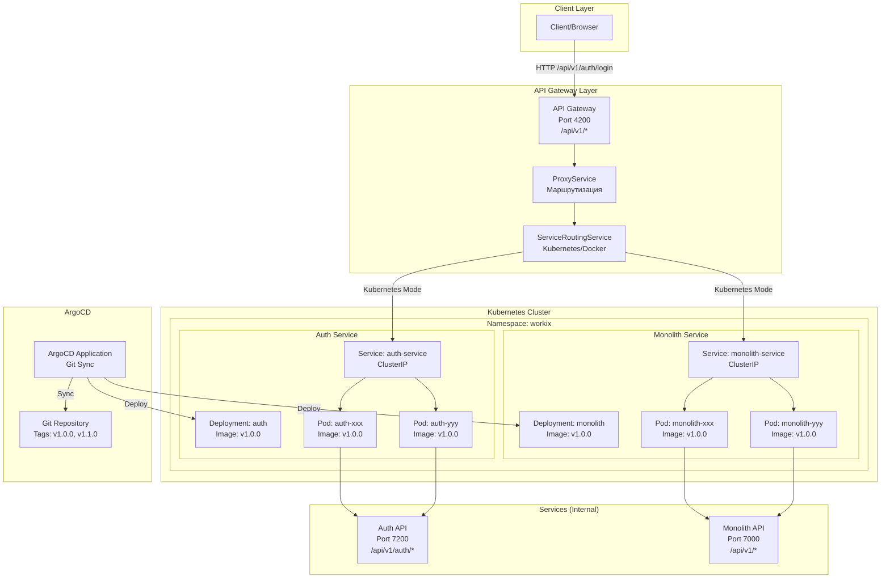

# 🏗️ Architecture: Kubernetes + ArgoCD + Версионирование API

**Date:** 2025-11-16

---

## 📊 Полная scheme архитектуры



---

## 🔄 Поток requestа

### 1. Client → Gateway

```
Client: GET /api/v1/auth/login
        ↓
Gateway: /api/v1/auth/login
        ↓
ProxyService.detectService() → 'auth'
        ↓
ServiceRoutingService.getServiceUrl('auth')
        ↓
Kubernetes Mode: http://auth-service.workix.svc.cluster.local
Docker Mode: http://localhost:7200
```

### 2. Gateway → Service

```
Gateway: buildServicePath('/api/v1/auth/login', 'auth')
         → Extract version: 'v1'
         → Clean path: '/auth/login'
         → Add prefix: '/api/v1'
         → Result: '/api/v1/auth/login'
        ↓
Request: http://auth-service.workix.svc.cluster.local/api/v1/auth/login
        ↓
Kubernetes Service: Load balance to Pod
        ↓
Auth API Pod: /api/v1/auth/login (globalPrefix = 'api/v1')
```

---

## 📋 Версионирование

### Уровень 1: API Версионирование (for clientов)

```
/api/v1/auth/login  → Auth API /api/v1/auth/login
/api/v2/auth/login  → Auth API /api/v2/auth/login (будущее)
```

**Наvalue:** Обратная совместимость API

### Уровень 2: Код Версионирование (for deployment)

```
Git Tag: v1.0.0
    ↓
ArgoCD Application
    ↓
Kubernetes Deployment
    ↓
Image: ghcr.io/workix/auth:v1.0.0
```

**Наvalue:** Управление версиями кода

### Уровень 3: Kubernetes Service (for маршрутизации)

```
Service URL: http://auth-service.workix.svc.cluster.local
    ↓
Load Balance
    ↓
Pods: auth-xxx (v1.0.0), auth-yyy (v1.0.0)
```

**Наvalue:** Service discovery и load balancing

---

## 🎯 Ключевые whenнципы

### 1. Версионирование API (v1, v2)

✅ **НУЖНО:**
- Обратная совместимость
- Постепенное введение breaking changes
- Поддержка старых clientов

❌ **НЕ НУЖНО в Kubernetes Service URL:**
- Service URL: `http://auth-service.workix.svc.cluster.local` (without версии)
- Версия API в пути: `/api/v1/auth/login`

### 2. Kubernetes Service Discovery

✅ **Использовать:**
- Service URL: `http://{service-name}-service.{namespace}.svc.cluster.local`
- Kubernetes automatically делает load balancing
- Health checks via liveness/readiness probes

❌ **НЕ use:**
- Прямые IP addressа Pods
- Версии в Service URL

### 3. ArgoCD for Deployment

✅ **Использовать:**
- Git tags for версионирования кода
- ArgoCD синхронизирует с Kubernetes
- Автоматический deployment when изменении Git

❌ **НЕ управлять via Gateway:**
- Gateway только маршрутизация
- Deployment via ArgoCD/Kubernetes

---

## 📊 Сравнение modeов

| Аспект | Kubernetes Mode | Docker Compose Mode |
|--------|----------------|---------------------|
| **Service URL** | `http://auth-service.workix.svc.cluster.local` | `http://localhost:7200` |
| **Load Balancing** | ✅ Kubernetes Service | ❌ Нет |
| **Health Checks** | ✅ liveness/readiness | ⚠️ Ручные |
| **Deployment** | ✅ ArgoCD/Kubernetes | ⚠️ Docker Compose |
| **Версионирование API** | ✅ `/api/v1/*` | ✅ `/api/v1/*` |
| **Версионирование кода** | ✅ Git tags → ArgoCD | ⚠️ Docker tags |

---

## 🔧 Конфигурация

### Environment Variables

```bash
# Kubernetes Mode
KUBERNETES_SERVICE_HOST=10.96.0.1
KUBERNETES_NAMESPACE=workix

# Docker Compose Mode (fallback)
AUTH_SERVICE_URL=http://localhost:7200
MONOLITH_URL=http://localhost:7000
```

### ServiceRoutingService Logic

```typescript
if (process.env.KUBERNETES_SERVICE_HOST) {
  // Kubernetes Mode
  return `http://${serviceName}-service.${namespace}.svc.cluster.local`;
} else {
  // Docker Compose Mode
  return process.env[`${serviceName}_SERVICE_URL`] || 'http://localhost:7000';
}
```

---

## ✅ Итоговая рекомендация

### Версионирование API: ✅ НУЖНО

**Причины:**
1. Обратная совместимость for clientов
2. Постепенное введение breaking changes
3. Поддержка старых версий API

**Реализация:**
- Gateway: `/api/v1/*`, `/api/v2/*` (будущее)
- Auth API: `/api/v1/*`
- Monolith API: `/api/v1/*`

### Kubernetes Service: ✅ БЕЗ версий в URL

**Причины:**
1. Service discovery не требует версий
2. Версия API в пути requestа
3. Версия кода via ArgoCD

**Реализация:**
- Service URL: `http://auth-service.workix.svc.cluster.local`
- Путь: `/api/v1/auth/login`

### ArgoCD: ✅ Управляет кодом

**Причины:**
1. GitOps approach
2. Автоматическая синхронизация
3. Управление версиями via Git tags

**Реализация:**
- Git tags: `v1.0.0`, `v1.1.0`
- ArgoCD Application синхронизирует с Kubernetes
- Gateway не управляет deployment

---

**Последнее update:** 2025-11-16
**Status:** ✅ Архитектура определена
