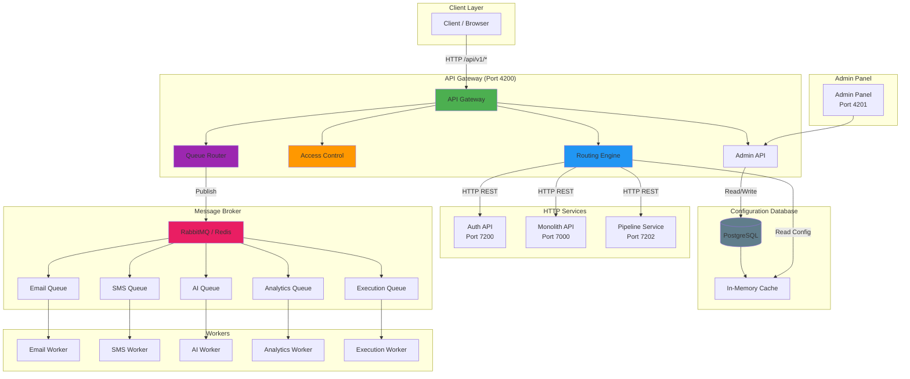
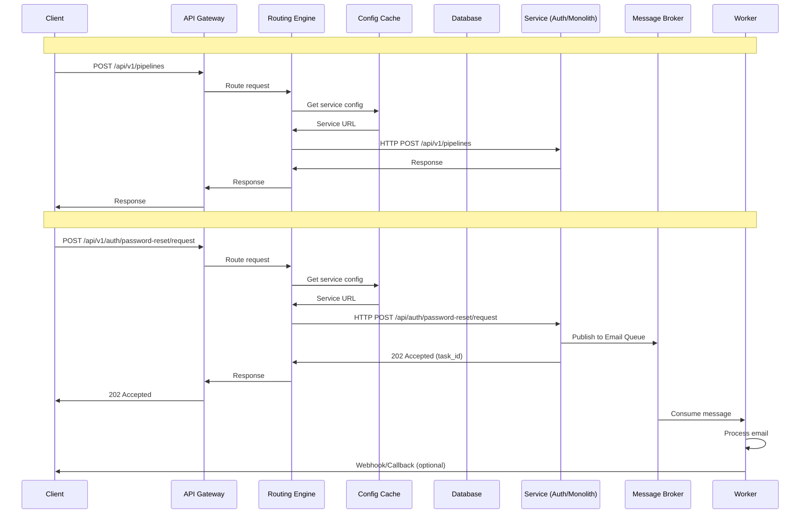
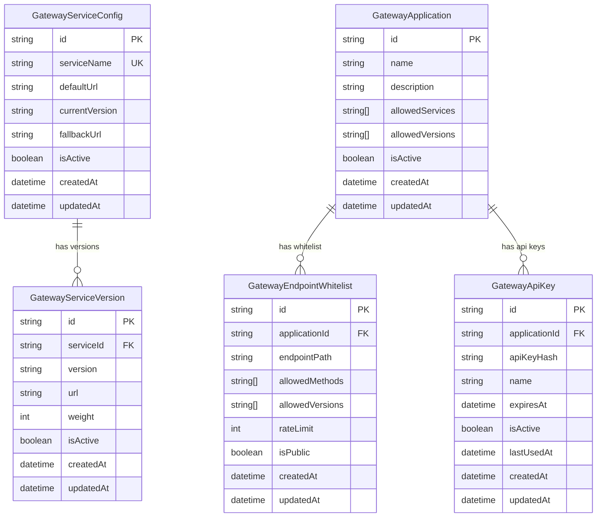
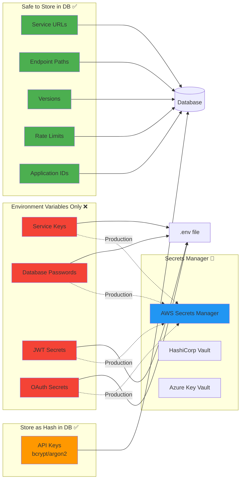
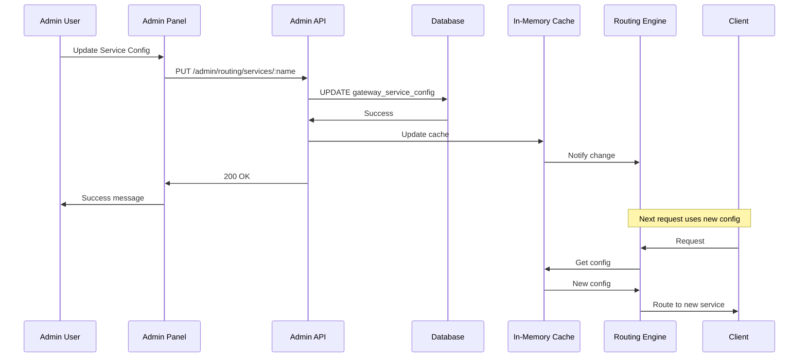

# 🏗️ API Gateway - 

**Date:** 2025-11-16

---

## 📊 

---

## 🔄 

---

## 🗄️ 

---

## 🔐 

---

## 🔄 

---

## 📊 

---

## 🎯 

### ✅ 
- Service URLs (
- Endpoint paths (
- Version numbers (
- Rate limiting rules (
- Application IDs (

### ⚠️ 
- API Keys (bcrypt/argon2 hash)
- 

### ❌ 
- Service Keys (
- Database passwords (
- JWT Secrets (
- OAuth Secrets (

### 🔐 Production (use Secrets Manager):
- AWS Secrets Manager
- HashiCorp Vault
- Azure Key Vault
- Google Secret Manager

---

**
**Status:** ✅ 
