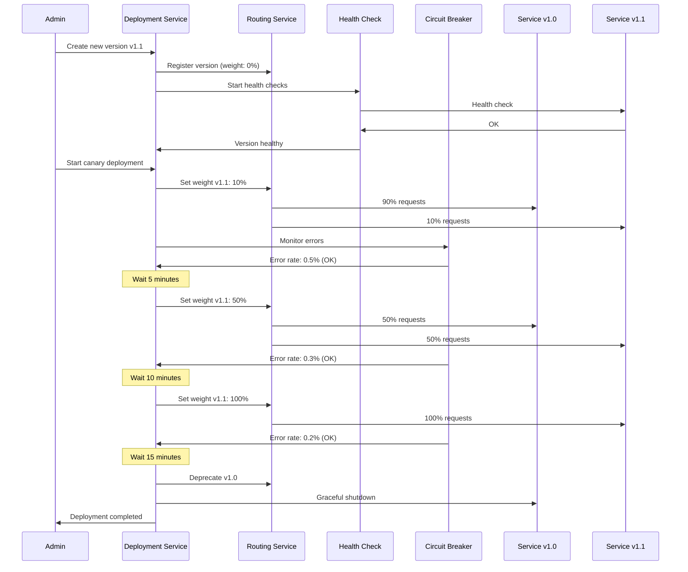

# 🚀 Zero-Downtime Deployment Plan for API Gateway

**Date:** 2025-11-16  
**Goal:** 

---

## 🎯 

1. ✅ **Zero-Downtime Deployment** - under
2. ✅ **
3. ✅ **Rollback mechanism** - 
4. ✅ **Health Checks** - 
5. ✅ **Graceful Shutdown** - 
6. ✅ **Load Balancing** - 
7. ✅ **

---

## 🏗️ 

```
┌─────────────────────────────────────────────────────────────┐
│                    ADMIN PANEL                              │
│  ┌──────────────────────────────────────────────────────┐  │
│  │  Deployment Manager                                   │  │
│  │  - Create new version                                │  │
│  │  - Health check new version                          │  │
│  │  - Gradual traffic shift (0% → 100%)                 │  │
│  │  - Rollback on errors                                │  │
│  └──────────────────────────────────────────────────────┘  │
└───────────────────────┬─────────────────────────────────────┘
                        │
                        │ HTTP API
                        │ /api/v1/admin/deployment/*
                        ▼
┌─────────────────────────────────────────────────────────────┐
│              API GATEWAY (Port 4200)                        │
│  ┌──────────────────────────────────────────────────────┐  │
│  │  Service Routing Service                             │  │
│  │  - Version Management                                │  │
│  │  - Health Check Service                              │  │
│  │  - Load Balancer (weight-based)                      │  │
│  │  - Circuit Breaker                                   │  │
│  └──────────────────────────────────────────────────────┘  │
└───────┬───────────┬───────────┬───────────┬───────────────┘
        │           │           │           │
    ┌───┴───┐   ┌───┴───┐   ┌───┴───┐   ┌───┴───┐
    │ v1.0  │   │ v1.1  │   │ v2.0  │   │ v2.1  │
    │ 100%  │   │  0%   │   │  0%   │   │  0%   │
    │ (old) │   │ (new) │   │ (new) │   │ (new) │
    └───┬───┘   └───┬───┘   └───┬───┘   └───┬───┘
        │           │           │           │
        └───────────┴───────────┴───────────┘
                    │
                    ▼
        ┌───────────────────────┐
        │  Health Check Service  │
        │  - Periodic checks     │
        │  - Auto-disable failed │
        └───────────────────────┘
```

---

## 📋 

### Phase 1: 

#### T-001: Health Check Service
**Goal:** 

**
1. 
2. 
3. 
4. 
5. 

**
```typescript
interface HealthCheckResult {
  serviceName: string;
  version: string;
  url: string;
  isHealthy: boolean;
  lastCheck: Date;
  responseTime: number;
  error?: string;
}

interface HealthCheckConfig {
  interval: number; // ms
  timeout: number; // ms
  retries: number;
  healthyThreshold: number; // consecutive successful checks
  unhealthyThreshold: number; // consecutive failed checks
}
```

**Files:**
- `libs/shared/backend/core/src/services/health-check.service.ts`
- `libs/shared/backend/core/src/interfaces/health-check.interface.ts`

---

#### T-002: Circuit Breaker Pattern
**Goal:** 

**
1. 
2. 
3. 
4. Fallback 

**
```typescript
interface CircuitBreakerState {
  serviceName: string;
  version: string;
  state: 'CLOSED' | 'OPEN' | 'HALF_OPEN';
  failureCount: number;
  lastFailureTime?: Date;
  nextAttemptTime?: Date;
}

interface CircuitBreakerConfig {
  failureThreshold: number; // 
  resetTimeout: number; // ms 
  halfOpenMaxCalls: number; // 
}
```

**Files:**
- `libs/shared/backend/core/src/services/circuit-breaker.service.ts`
- `libs/shared/backend/core/src/interfaces/circuit-breaker.interface.ts`

---

#### T-003: Weight-Based Load Balancer
**Goal:** 

**
1. 
2. 
3. 
4. Round-robin 

**
```typescript
// 
// Random: 0-79 → v1.0, 80-99 → v1.1
function selectVersion(versions: ServiceVersion[]): ServiceVersion {
  const totalWeight = versions.reduce((sum, v) => sum + v.weight, 0);
  const random = Math.random() * totalWeight;
  let current = 0;
  for (const version of versions) {
    current += version.weight;
    if (random <= current) {
      return version;
    }
  }
  return versions[0]; // fallback
}
```

**Files:**
- 

---

#### T-004: Database Schema for Deployment
**Goal:** 

**
1. 
2. 
3. 

**Prisma Schema:**
```prisma
model GatewayServiceVersion {
  id            String   @id @default(uuid())
  serviceId      String
  version        String
  url            String
  weight         Int      @default(0) // 0-100, for 
  isActive       Boolean  @default(false) // 
  status         String   @default("testing") // testing, staging, production, deprecated
  healthStatus   String   @default("unknown") // healthy, unhealthy, unknown
  lastHealthCheck DateTime?
  createdAt      DateTime @default(now())
  updatedAt      DateTime @updatedAt

  service        GatewayServiceConfig @relation(fields: [serviceId], references: [id], onDelete: Cascade)

  @@unique([serviceId, version])
  @@map("gateway_service_version")
}

model GatewayDeployment {
  id              String   @id @default(uuid())
  serviceName     String
  fromVersion     String?  // 
  toVersion       String   // 
  status          String   @default("pending") // pending, testing, rolling, completed, failed, rolled_back
  strategy        String   @default("canary") // canary, blue-green, immediate
  trafficPercent  Int      @default(0) // 
  targetPercent   Int      @default(100) // 
  startedAt       DateTime?
  completedAt     DateTime?
  rolledBackAt    DateTime?
  errorMessage    String?
  createdBy       String?  // userId
  createdAt       DateTime @default(now())
  updatedAt       DateTime @updatedAt

  @@map("gateway_deployment")
}
```

**Files:**
- 

---

#### T-005: Deployment Service
**Goal:** 

**
1. 
2. 
3. 
4. 

**
```typescript
class DeploymentService {
  // 
  async createVersion(serviceName: string, version: ServiceVersion): Promise<void>
  
  // 
  async testVersion(serviceName: string, version: string): Promise<HealthCheckResult>
  
  // 
  async startDeployment(deployment: DeploymentConfig): Promise<Deployment>
  
  // 
  async increaseTraffic(deploymentId: string, percent: number): Promise<void>
  
  // 
  async rollback(deploymentId: string): Promise<void>
  
  // 
  async completeDeployment(deploymentId: string): Promise<void>
}
```

**Files:**
- `apps/api-gateway/src/app/services/deployment.service.ts`
- `apps/api-gateway/src/app/interfaces/deployment.interface.ts`

---

### Phase 2: Deployment Strategies (3 

#### T-006: Canary Deployment
**Goal:** 

**
1. 
2. 
3. 
4. 

**
```


```

**Configuration:**
```typescript
interface CanaryConfig {
  initialPercent: number; // 10
  steps: number[]; // [10, 50, 100]
  stepInterval: number; // ms between 
  errorThreshold: number; // % 
  autoPause: boolean; // 
}
```

---

#### T-007: Blue-Green Deployment
**Goal:** 

**
1. 
2. 
3. 
4. 

**
```


```

---

#### T-008: Immediate Deployment
**Goal:** 

**
1. 
2. 
3. 

---

### Phase 3: Admin API 

#### T-009: Deployment Controller
**Goal:** REST API for 

**
```typescript
// 
POST /api/v1/admin/deployment/versions
Body: { serviceName, version, url }

// 
POST /api/v1/admin/deployment/versions/:id/test

// 
POST /api/v1/admin/deployment/start
Body: { serviceName, fromVersion, toVersion, strategy, config }

// 
PUT /api/v1/admin/deployment/:id/traffic
Body: { percent }

// 
POST /api/v1/admin/deployment/:id/rollback

// 
POST /api/v1/admin/deployment/:id/complete

// 
GET /api/v1/admin/deployment/:id

// 
GET /api/v1/admin/deployment
```

**Files:**
- `apps/api-gateway/src/app/controllers/deployment.controller.ts`

---

#### T-010: Deployment Status Dashboard
**Goal:** 

**
1. 
2. 
3. Health check status
4. 
5. 

---

#### T-011: Automated Testing Integration
**Goal:** 

**
1. 
2. 
3. 
4. 

**
```typescript
interface SmokeTestConfig {
  endpoints: Array<{
    method: 'GET' | 'POST' | 'PUT' | 'DELETE';
    path: string;
    expectedStatus: number;
    body?: unknown;
  }>;
  timeout: number;
  retries: number;
}
```

---

#### T-012: Metrics 
**Goal:** 

**
- Error rate 
- Response time 
- Request count 
- Health check status
- Circuit breaker 

**
- Prometheus metrics
- Grafana dashboards
- Alerting when problem

---

### Phase 4: Graceful Shutdown (2 

#### T-013: Graceful Shutdown for service
**Goal:** 

**
1. 
2. 
3. 
4. 

**
```
1. Gateway 
2. Gateway 
3. 
4. 
5. 
6. Gateway 
```

---

#### T-014: Connection Draining
**Goal:** 

**
1. 
2. 
3. 

---

## 🔄 

### 

```typescript
// 1. 
POST /api/v1/admin/deployment/versions
{
  "serviceName": "auth",
  "version": "v1.1",
  "url": "http://localhost:7201",
  "weight": 0,
  "status": "testing"
}
```

### 

```typescript
// 2. 
POST /api/v1/admin/deployment/versions/:id/test
// Health checks, smoke tests
// Result: { isHealthy: true, tests: [...] }
```

### 

```typescript
// 3. 
POST /api/v1/admin/deployment/start
{
  "serviceName": "auth",
  "fromVersion": "v1.0",
  "toVersion": "v1.1",
  "strategy": "canary",
  "config": {
    "steps": [10, 50, 100],
    "stepInterval": 300000, // 5 
    "errorThreshold": 5, // 5% 
    "autoPause": true
  }
}
```

### 

```


```

### 

```typescript
// 
POST /api/v1/admin/deployment/:id/rollback
// 
```

---

## 🗄️ Database Schema (

```prisma
model GatewayServiceVersion {
  id            String   @id @default(uuid())
  serviceId     String
  version       String
  url           String
  weight        Int      @default(0) // 0-100 for load balancing
  isActive      Boolean  @default(false)
  status        String   @default("testing") // testing, staging, production, deprecated
  healthStatus  String   @default("unknown") // healthy, unhealthy, unknown
  lastHealthCheck DateTime?
  failureCount  Int      @default(0) // for circuit breaker
  circuitState  String   @default("CLOSED") // CLOSED, OPEN, HALF_OPEN
  createdAt     DateTime @default(now())
  updatedAt     DateTime @updatedAt

  service       GatewayServiceConfig @relation(fields: [serviceId], references: [id], onDelete: Cascade)
  deployments   GatewayDeployment[]

  @@unique([serviceId, version])
  @@map("gateway_service_version")
}

model GatewayDeployment {
  id              String   @id @default(uuid())
  serviceName     String
  fromVersionId   String?
  toVersionId     String
  status          String   @default("pending") // pending, testing, rolling, completed, failed, rolled_back
  strategy        String   @default("canary") // canary, blue-green, immediate
  trafficPercent  Int      @default(0)
  targetPercent   Int      @default(100)
  currentStep     Int      @default(0) // for canary: 
  config          Json     // strategy-
  startedAt       DateTime?
  completedAt     DateTime?
  rolledBackAt    DateTime?
  errorMessage    String?
  errorCount      Int      @default(0)
  requestCount    Int      @default(0)
  createdBy       String?
  createdAt       DateTime @default(now())
  updatedAt       DateTime @updatedAt

  fromVersion     GatewayServiceVersion? @relation("FromVersion", fields: [fromVersionId], references: [id])
  toVersion       GatewayServiceVersion @relation("ToVersion", fields: [toVersionId], references: [id])

  @@map("gateway_deployment")
}

model GatewayHealthCheck {
  id            String   @id @default(uuid())
  versionId     String
  isHealthy     Boolean
  responseTime  Int      // ms
  statusCode    Int?
  errorMessage  String?
  checkedAt     DateTime @default(now())

  version       GatewayServiceVersion @relation(fields: [versionId], references: [id], onDelete: Cascade)

  @@map("gateway_health_check")
}
```

---

## 🔧 

### 1. 

**
```typescript
getServiceUrl(serviceName: string, version?: string): string {
  // 
}
```

**
```typescript
getServiceUrl(serviceName: string, version?: string): string {
  // 1. 
  // 2. 
  // 3. 
  // 4. 
  // 5. 
}
```

### 2. 

**
- Retry 
- Circuit breaker 
- Health check before request
- 

---

## 📊 



---

## ✅ 

### Phase 1: 
- [ ] T-001: Health Check Service
- [ ] T-002: Circuit Breaker Service
- [ ] T-003: Weight-Based Load Balancer
- [ ] T-004: Database Schema
- [ ] T-005: Deployment Service

### Phase 2: Deployment Strategies
- [ ] T-006: Canary Deployment
- [ ] T-007: Blue-Green Deployment
- [ ] T-008: Immediate Deployment

### Phase 3: Admin API 
- [ ] T-009: Deployment Controller
- [ ] T-010: Deployment Dashboard
- [ ] T-011: Automated Testing
- [ ] T-012: Metrics 

### Phase 4: Graceful Shutdown
- [ ] T-013: Graceful Shutdown
- [ ] T-014: Connection Draining

---

## 🎯 

### 

1. **
   - 
   - 
   - 

2. **Canary Deployment 
   - 
   - 
   - 

3. **Health Checks 
   - 
   - 
   - 

4. **Circuit Breaker 
   - 
   - Fallback 
   - 

---

## 📝 

### 1. 

```bash
# 
docker run -d -p 7201:7200 auth-service:v1.1
```

### 2. 

```typescript
POST /api/v1/admin/deployment/versions
{
  "serviceName": "auth",
  "version": "v1.1",
  "url": "http://localhost:7201",
  "weight": 0 // 
}
```

### 3. 

```typescript
POST /api/v1/admin/deployment/versions/:id/test
// 
// Result: { isHealthy: true }
```

### 4. 

```typescript
POST /api/v1/admin/deployment/start
{
  "serviceName": "auth",
  "toVersion": "v1.1",
  "strategy": "canary",
  "steps": [10, 50, 100], // 
  "stepInterval": 300000 // 5 
}
```

### 5. 

```
0:00 - v1.0: 100%, v1.1: 0%
0:05 - v1.0: 90%, v1.1: 10% ✅
0:15 - v1.0: 50%, v1.1: 50% ✅
0:30 - v1.0: 0%, v1.1: 100% ✅
0:40 - 
```

### 6. 

```typescript
POST /api/v1/admin/deployment/:id/rollback
// 
```

---

## 🔐 

1. **RBAC for Deployment API:**
   - 
   - 
   - Audit trail

2. **
   - 
   - 
   - 

3. **Rate Limiting:**
   - 
   - 

---

**
**Status:** 📋 

